<div align="center">



<br>

<p>
  <a href="https://github.com/Eshanu03">
    
  </a>
  
  
  
</p>

</div>

---

# 👋 Hello, I'm Eshanu Mondal

### Web Designer • Graphics Designer • UI/UX Creator

I design and build **modern digital experiences** where visual design, interaction and technology come together.

My work focuses on creating interfaces that are not only visually appealing, but also **usable, responsive, structured and functional**.

I work across both **design and development**, allowing me to take an idea from an initial concept to a complete digital experience.

---

## ✦ What I Do

<table>
<tr>
<td width="33%" valign="top">

### 🎨 Graphics Design

Creating visual identities and digital graphics with a strong focus on composition, hierarchy and visual consistency.

**Areas**

- Brand Identity
- Logo Design
- Social Media Graphics
- Marketing Creatives
- Digital Artwork
- Presentation Design
- Visual Systems

</td>

<td width="33%" valign="top">

### 🖥️ Web Development

Building responsive and functional websites with clean structures and modern interfaces.

**Areas**

- Landing Pages
- Responsive Websites
- Interactive Interfaces
- Frontend Development
- Backend Integration
- Web Applications
- Dashboard Interfaces

</td>

<td width="33%" valign="top">

### 🧩 UI/UX Design

Designing user experiences that balance aesthetics, usability and interaction.

**Areas**

- UI Design
- UX Research
- Wireframing
- Prototyping
- Design Systems
- User Flows
- Interaction Design

</td>
</tr>
</table>

---

# ⚡ My Creative + Development Stack

### Frontend

<p>


</p>

### Backend & Database

<p>


</p>

### Design

<p>


</p>

### Tools

<p>


</p>

---

# 🧠 How I Approach Projects

```text
       IDEA
        │
        ▼
   ┌───────────┐
   │  DISCOVER  │
   └─────┬─────┘
         │
         ▼
   ┌───────────┐
   │  STRATEGY  │
   └─────┬─────┘
         │
         ▼
   ┌───────────┐
   │   DESIGN   │
   └─────┬─────┘
         │
         ▼
   ┌───────────┐
   │ PROTOTYPE  │
   └─────┬─────┘
         │
         ▼
   ┌───────────┐
   │  DEVELOP   │
   └─────┬─────┘
         │
         ▼
   ┌───────────┐
   │   TEST     │
   └─────┬─────┘
         │
         ▼
   ┌───────────┐
   │   REFINE   │
   └─────┬─────┘
         │
         ▼
      LAUNCH
